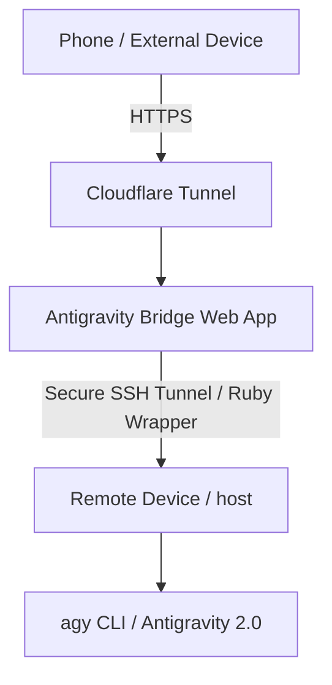

# Antigravity Bridge

A premium web application bridge designed to expose and stream responses from your **Antigravity 2.0 (`agy` CLI)** instance running on your remote device over a Cloudflare Tunnel.



---

## Key Features
- **Real-time Streaming**: Utilizes Server-Sent Events (SSE) to stream responses chunk-by-chunk directly to your browser.
- **Secure by Design**: Connects over SSH using key-based authentication. Features a Ruby-based JSON subprocess runner on the remote machine to completely eliminate shell-command injection risks.
- **Premium Interface**: A gorgeous dark-mode chat UI with glassmorphism panels, fluid scrollbars, markdown parsing, and code syntax highlighting.
- **Threaded Mode**: Easily persist and continue conversations by preserving thread context.
- **Mobile First**: Built with responsive layouts tailored for access on smartphones and tablets outside your home network.
- **Dockerized**: Ready to deploy alongside your other containers.

---

## 1. Setup SSH Access

The bridge requires SSH key authorization to connect to your remote device.

Generate an SSH key pair (e.g. at `~/.ssh/id_ed25519_antigravity`).

To authorize the key, run the following command **on your remote device**:
```bash
mkdir -p ~/.ssh && echo "YOUR_SSH_PUBLIC_KEY" >> ~/.ssh/authorized_keys && chmod 600 ~/.ssh/authorized_keys
```

*(Replace `YOUR_SSH_PUBLIC_KEY` with the content of your generated public key file, e.g. `~/.ssh/id_ed25519_antigravity.pub`)*

---

## 2. Configuration (`.env`)

A default `.env` file should be created in the project directory. Map your remote hostname, SSH username, and paths in this file:

```ini
# Connection mode: 'ssh' (remote execution) or 'local'
AG_CONNECTION_MODE=ssh

# SSH Configuration
AG_SSH_HOST=your-remote-host-ip
AG_SSH_USER=username
AG_SSH_KEY_PATH=~/.ssh/id_ed25519_antigravity

# Remote CLI Path
AG_CLI_PATH=/Users/username/.local/bin/agy

PORT=3333
```

---

## 3. Running the App

### Option A: Running Locally (Node.js)

1. Open your terminal in the project directory:
   ```bash
   cd /path/to/antigravity-bridge
   ```
2. Install dependencies:
   ```bash
   npm install
   ```
3. Run the development server:
   ```bash
   npm run dev
   ```
4. Access the web interface at: `http://localhost:3333`

### Option B: Running in Docker

You can spin up the bridge using `docker-compose`. It will automatically compile, install dependencies, mount the required SSH key, and bind to port `3333`.

1. Run the container:
   ```bash
   docker compose up -d --build
   ```
2. Check logs:
   ```bash
   docker compose logs -f
   ```
3. Access at `http://localhost:3333`

---

## 4. Routing via Cloudflare Tunnel

To make this web app accessible on your phone outside your home network:

1. Log in to your Cloudflare Zero Trust Dashboard.
2. Select your active tunnel.
3. Add a public hostname (e.g. `antigravity.yourdomain.com`).
4. Configure the service:
   - **Type**: `HTTP`
   - **URL**: `localhost:3333` (or the IP of the machine hosting the container, e.g. `192.168.1.115:3333`).
5. Save. You can now access your Antigravity Instance securely from your phone using your domain name!
