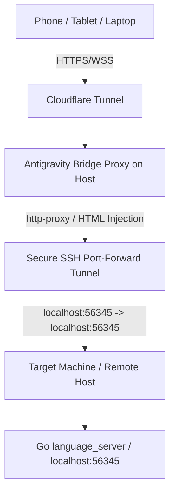

# Antigravity Bridge

A reverse proxy and SSH tunnel bridge that serves the **Antigravity 2.0 Web UI** from a remote machine, making it accessible on any device on your local network or remotely via Cloudflare Tunnel. The proxy intercepts HTML responses to inject a custom design system, fluid animations, and a fully responsive mobile layout.



---

## How It Works

The entire bridge is a single file — [`server.js`](server.js) — which does five things:

### 1. SSH Tunnel

On startup (when `AG_CONNECTION_MODE=ssh`), the script spawns an SSH process that port-forwards `localhost:56345` on the proxy host to `localhost:56345` on the remote machine where the Antigravity Go backend (`language_server`) is running:

```
ssh -i <key> -N -L 56345:localhost:56345 user@remote-host
```

This tunnel remains open for the lifetime of the process and is cleaned up on `SIGTERM` / `SIGINT`.

### 2. Reverse Proxy

An Express server on port `3333` (configurable via `PORT`) proxies all HTTP and WebSocket traffic to `localhost:56345` through the tunnel using `http-proxy`. Two critical header rewrites happen on every proxied request:

- **`Origin`** → rewritten to `http://localhost:56345` on both HTTP and WebSocket upgrade requests, bypassing the Go backend's strict origin-checking security.
- **`Referer`** → host portion rewritten to `localhost:56345` to pass referer validation.

### 3. HTML Injection Pipeline

When the proxy detects an `Accept: text/html` request (the initial page load), it intercepts the response from the backend, reads the full HTML body, and injects a `<script>` and `<style>` block into `<head>` before forwarding it to the client. The response includes a `Cache-Control: no-store` header to ensure changes take effect immediately on refresh.

The injected content includes:

#### JavaScript Shims

| Shim | Purpose |
|------|---------|
| `window.nativeStorage` | Maps `getItems()`, `updateItems()`, and `onChanged()` to `localStorage`, preventing the "No native storage bridge found" crash that occurs outside Electron. |
| `window.electronNative` | Provides `zoomLevel`, `zoomIn()`, `zoomOut()`, `resetZoom()`, and stub window controls (`minimize`, `maximize`, `close`). Sets initial zoom to `1.0` (100%) to prevent the default 1.2x fallback. |
| Mobile sidebar monitor | A `setInterval` loop that polls the sidebar's `.border-border` grandparent container for its `width` style. Sets `data-sidebar-open="true"` or `"false"` on `<html>` and manages a blurred backdrop overlay (`z-index: 9998`) that closes the drawer on tap. |
| Auto-close on mobile | On viewports under `768px`, automatically clicks the sidebar toggle button at startup to collapse the drawer. |

#### Theme: Oxford Navy

The injected `<style>` block forces a single dark theme by setting CSS custom properties on `:root`:

| Variable | Value | Usage |
|----------|-------|-------|
| `--bg-primary` | `hsl(222, 20%, 9%)` | Main background |
| `--bg-secondary` | `hsl(222, 16%, 12%)` | Sidebar background |
| `--bg-tertiary` | `hsl(222, 14%, 16%)` | Card/input background |
| `--border-color` | `hsla(222, 12%, 50%, 0.08)` | Subtle borders |
| `--text-primary` | `hsl(40, 15%, 90%)` | Body text |
| `--text-secondary` | `hsl(218, 12%, 68%)` | Secondary text |
| `--text-muted` | `hsl(218, 8%, 48%)` | Muted labels |
| `--accent` | `hsl(43, 40%, 65%)` | Gold/brass accent |

These variables are mapped to the app's Tailwind utility classes (`.bg-background`, `.bg-sidebar`, `.bg-card`, `.text-foreground`, etc.) using `!important` overrides.

#### Typography

Three Google Fonts are loaded via `<link>` tags injected into `<head>`:

- **Instrument Serif** — headings, sidebar labels, the "+ New Conversation" button
- **Inter** — body text, buttons, UI controls
- **JetBrains Mono** — code blocks

#### Layout Modifications

| Element | Change |
|---------|--------|
| Chat content column | Constrained to `max-width: 44rem` and centered with `margin: auto` |
| Header bar | Thin `0.5px` bottom border, `3.5rem` height |
| "Open IDE" button | Hidden via `[data-testid="open-editor-single"] { display: none }` |
| Sidebar toggle | Excluded from header button overrides via `:not([data-testid="sidebar-toggle"])` |
| Writing pad (`.bg-card`) | Flat thin border, `8px` radius, no shadows |
| Prompt toolbar buttons | Transparent backgrounds, lowercase text labels ("attach", "voice") |
| Sidebar items | Hidden folder icons, thin outline "+ New Conversation" button |
| Shadows | All `.shadow-*` classes set to `box-shadow: none` |
| Scrollbars | `4px` wide, transparent track, subtle thumb |

### 4. Fluid Animations

All animations use a consistent `cubic-bezier(0.2, 0.8, 0.2, 1)` (easeOutExpo) curve:

| Animation | Details |
|-----------|---------|
| Button hover | `translateY(-1px)` over `0.15s` |
| Button press | `translateY(0) scale(0.99)` |
| Sidebar toggle hover | `translateY(-1px) rotate(4deg)` over `0.2s` |
| Writing pad focus | Border-color transition to `--accent` over `0.2s` (no layout shift) |
| Message entry | `@starting-style` slide-up `8px` + fade over `0.35s` |
| Sidebar items | `listSlideIn` keyframe (slide `4px` from left), staggered `0.02s` per item |
| Sidebar item hover | `translateX(3px)` + gold text color |
| Desktop sidebar open/close | `width 0.35s` transition; bypasses React's `display: none` by forcing `display: flex !important` on the wrapper |

### 5. Mobile Responsive Layout (`@media max-width: 768px`)

The mobile overrides use `:has(.bg-sidebar)` selectors to reliably target the sidebar wrapper regardless of the React-generated class structure:

| Behavior | Implementation |
|----------|----------------|
| Sidebar drawer | `position: fixed; z-index: 9999; width: 280px` overlay with `translateX(-100%)` / `translateX(0)` slide |
| Backdrop | Blurred `rgba(0,0,0,0.4)` fixed overlay at `z-index: 9998`, closes sidebar on tap |
| Content area | Stays full-width (`100%`) while sidebar is open — no squishing |
| Padding | Reduced to `0.5rem` globally |
| Touch targets | `40px` minimum width/height on all interactive elements |
| Card buttons | `11px` font, `4px 6px` padding to prevent overflow |
| Code blocks | `11px` font, `overflow-x: auto` for horizontal scrolling |

---

## Setup

### 1. SSH Authorization

Generate an SSH key pair and authorize it on the remote machine:

```bash
# On proxy host
ssh-keygen -t ed25519 -f ~/.ssh/id_ed25519_antigravity

# On remote machine
mkdir -p ~/.ssh && echo "YOUR_PUBLIC_KEY" >> ~/.ssh/authorized_keys && chmod 600 ~/.ssh/authorized_keys
```

### 2. Configuration (`.env`)

Create a `.env` file in the project root:

```ini
# Connection mode: 'ssh' (remote) or 'local' (same host)
AG_CONNECTION_MODE=ssh

# SSH Configuration
AG_SSH_HOST=your-remote-host-ip
AG_SSH_USER=your-ssh-username
AG_SSH_KEY_PATH=~/.ssh/id_ed25519_antigravity

# Proxy listen port
PORT=3333
```

### 3. Running

#### Option A: Docker (Recommended)

```bash
sudo docker compose up -d --build
sudo docker compose logs -f
```

Access at `http://<your-host-ip>:3333`

#### Option B: Node.js

```bash
npm install
node server.js
```

Access at `http://localhost:3333`

---

## Remote Access (Cloudflare Tunnel)

To access from outside your local network:

1. In Cloudflare Zero Trust, create or navigate to your tunnel.
2. Add a public hostname (e.g. `antigravity.yourdomain.com`).
3. Set the service to **HTTP** → `localhost:3333`.
4. Save. The UI is now accessible from any device.

---

## Project Structure

```
antigravity-bridge/
├── server.js            # Entire proxy: SSH tunnel, reverse proxy, HTML injection, CSS/JS
├── package.json         # Dependencies: express, http-proxy, dotenv
├── .env                 # Local configuration (gitignored)
├── .env.example         # Configuration template
├── Dockerfile           # Container build
└── docker-compose.yml   # Container orchestration
```

## Dependencies

| Package | Purpose |
|---------|---------|
| `express` | HTTP server and middleware routing |
| `http-proxy` | Reverse proxy for HTTP and WebSocket traffic |
| `dotenv` | Environment variable loading from `.env` |
