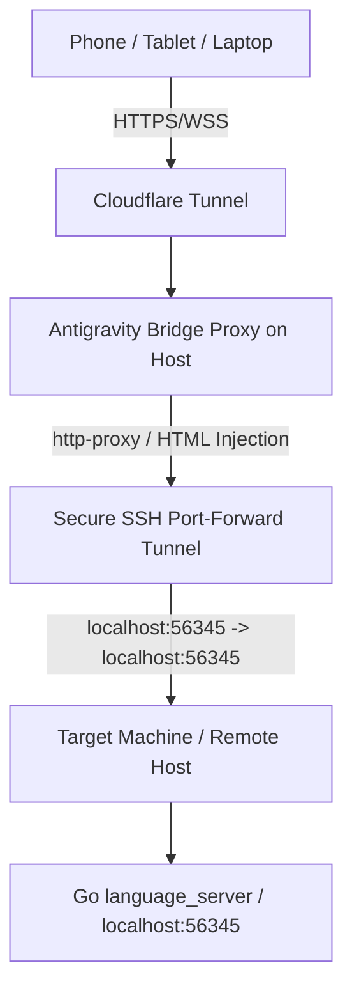

# Antigravity Bridge - Official Antigravity 2.0 Web UI Proxy

A secure, high-performance reverse proxy and SSH tunnel bridge designed to expose and serve the official **Google Antigravity 2.0 Web UI** running on a remote machine, making it accessible on any device on your local network or remotely over a Cloudflare Tunnel.



---

## 🛠️ Key Features

* **Official Google 2.0 Web UI**: Serves the authentic, compiled SPA (`main.js`, `jetbox.css`) directly from the target machine backend rather than a custom wrapper, giving you access to all native features like multi-agent workspace coordination, trajectory viewer, debug consoles, and extension panels.
* **Integrated SSH Tunneling**: Automatically establishes a secure SSH port-forwarding tunnel (`localhost:56345 -> remote:56345`) on startup, proxying both raw HTTP traffic and WebSocket upgrades (`ws://` / `wss://`) for real-time agent streams.
* **Electron Bridge Simulation**: 
  - **Native Storage Shim**: Injects a custom JavaScript `window.nativeStorage` implementation into the HTML document, transparently mapping preferences and configuration states to the browser's standard `window.localStorage` (preventing the `No native storage bridge found` crash).
  - **Electron Zoom & Native Actions**: Injects a mock `window.electronNative` object to prevent the default 1.2x (120%) zoom-in fallback, letting the app launch at a clean 100% zoom and enabling in-app zoom settings to dynamically scale the page in your browser using CSS `zoom`.
* **Host Header Overriding**: Automatically rewrites request `Host` headers to `localhost` to bypass the backend Go server's strict hostname security filters (resolving host-checking security errors like `localhost only`).
* **Mobile Responsive Drawer Layout**: 
  - Automatically collapses the left sidebar drawer on screen sizes under `768px` at startup.
  - Transforms the sidebar layout on mobile viewports into a sliding overlay drawer rather than compressing the main chat space.
  - Automatically closes the drawer if the user taps outside of it (e.g. in the chat area).
  - Hides desktop resize handles and drag sashes on touch screens to prevent layout breakages.

---

## 🔑 1. Setup SSH Authorization

The bridge requires SSH key authorization to connect from the proxy host to the target machine.

1. Generate an SSH key pair on your machine (e.g., at `~/.ssh/id_ed25519_antigravity`).
2. Add the public key to the remote target's `authorized_keys` file:
   ```bash
   mkdir -p ~/.ssh && echo "YOUR_SSH_PUBLIC_KEY" >> ~/.ssh/authorized_keys && chmod 600 ~/.ssh/authorized_keys
   ```

---

## ⚙️ 2. Configuration (`.env`)

Create a `.env` file in the project root directory:

```ini
# Connection mode: 'ssh' (remote execution) or 'local' (if running on same host)
AG_CONNECTION_MODE=ssh

# SSH Configuration (target machine where agy runs)
AG_SSH_HOST=your-remote-host-ip
AG_SSH_USER=your-ssh-username
# Host path to the private SSH key
AG_SSH_KEY_PATH=/path/to/your/id_ed25519_antigravity

# Port the bridge proxy server will listen on
PORT=3333
```

> [!NOTE]
> If running in Docker (see below), the private key path inside the container is mapped via `docker-compose.yml` to `/root/.ssh/id_ed25519_antigravity` so the application handles this path mapping override automatically.

---

## 🚀 3. Running the Proxy

### Option A: Running in Docker (Recommended)
The docker container maps key directories, installs production packages, starts the background SSH tunnel, and exposes port `3333` securely.

1. Build and launch the container:
   ```bash
   sudo docker compose up -d --build
   ```
2. Monitor tunnel and proxy activity:
   ```bash
   sudo docker compose logs -f
   ```
3. Access the UI in your web browser at: `http://<your-host-ip>:3333`

### Option B: Running Locally (Node.js)
1. Install dependencies:
   ```bash
   npm install
   ```
2. Run the proxy server:
   ```bash
   node server.js
   ```
3. Open `http://localhost:3333` in your browser.

---

## 🌐 4. Exposing Remotely (Cloudflare Tunnel)

To access your Antigravity workspace on your phone outside your home network:

1. In your Cloudflare Zero Trust Dashboard, set up or navigate to your active tunnel.
2. Add a public hostname (e.g. `antigravity.yourdomain.com`).
3. Set the service destination to point to the bridge container:
   - **Type**: `HTTP`
   - **URL**: `localhost:3333` (or the IP of your bridge host, e.g. `your-bridge-host-ip:3333`).
4. Save. The official Antigravity 2.0 Web UI is now securely accessible from any device using your domain name, fully responsive and functional!
